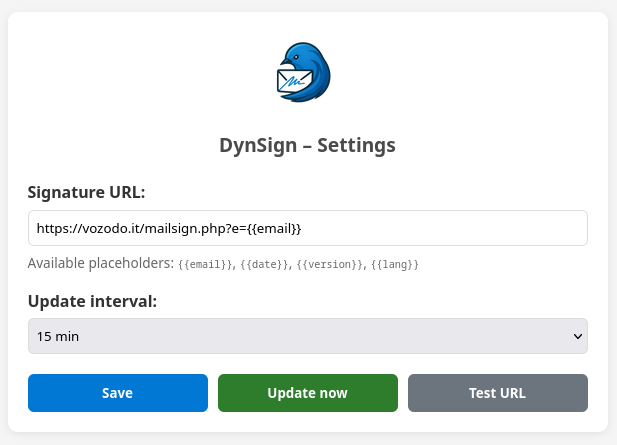
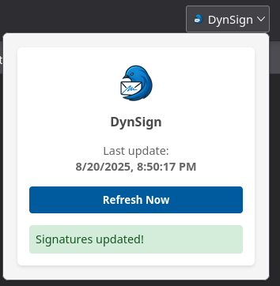

# DynSign

**DynSign** is a Thunderbird extension that dynamically inserts a signature into your emails.
It allows you to keep your email signature up to date without having to manually edit it in Thunderbird.

## Features

- 🔄 **Dynamic signature loading**: Fetches your signature from a remote URL.
- ⏱️ **Automatic updates**: Refreshes the signature at defined intervals.
- 🖱️ **Manual refresh**: Update the signature instantly via a toolbar button.
- ⚡ **Seamless integration**: The signature is automatically appended to your composed emails.

## Screenshots

### Extension settings



### Toolbar button



## Use Cases

- Centralized signature management for teams.
- Company-wide signature updates without user interaction.
- Rotating or time-based signatures (e.g., campaigns, promotions).

## Installation

1. Clone or download this repository.
2. In Thunderbird, go to **Add-ons and Themes** → **Extensions**.
3. Click on the gear icon and select **Install Add-on From File…**.
4. Choose the `.xpi` file you built from this project.

## Configuration

- Set the **signature URL** in the extension’s settings.
- Define the **update interval** or use the **manual refresh** button.

## Development

If you want to build or modify the extension:

```bash
git clone https://github.com/vozodo/DynSign.git
cd DynSign
```

You can then package it into a `.xpi` file and load it into Thunderbird for testing.

## Contributing

Contributions, issues, and feature requests are welcome!
Feel free to open an issue or submit a pull request.

## License

This project is licensed under the [GNU GPL Version 3](LICENSE).
